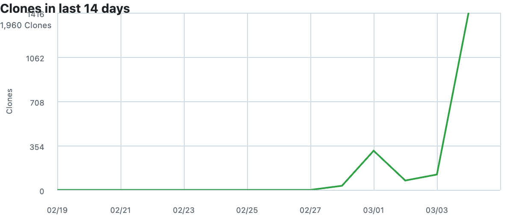

# 让你的智能体“开口说话”

[English](./README.md) | 简体中文

用于集中管理 Skills 的仓库，专注于打造更"像人"的语音对话体验。

## 用 `npx skills add` 安装

```bash
# 查看 GitHub 仓库可安装技能
npx skills add NoizAI/skills --list --full-depth

# 从 GitHub 仓库安装指定技能
npx skills add NoizAI/skills --full-depth --skill tts -y

# 从 GitHub 仓库安装
npx skills add NoizAI/skills

# 本地开发（在当前仓库目录执行）
npx skills add . --list --full-depth
```

## 亮点

- 🔒 安全且本地优先：在你自己的机器上运行技能，敏感文本和资源无需上传。
- 🧠 人格化语音控制：微调语气词、情绪参数和场景预设，打造有陪伴感的输出。
- 🎙️ 生产级语音：从快速 TTS 生成到时间轴精确渲染，一步到位。

## 已有技能

| 名称 | 说明 | 文档 | 可运行命令 |
|------|------|------|------------|
| tts | 将文本转为语音，支持 Kokoro / Noiz：简单模式、时间轴精确渲染、精确时长控制与参考音频音色克隆。 | [SKILL.md](./skills/tts/SKILL.md) | `npx skills add NoizAI/skills --full-depth --skill tts -y` |
| chat-with-anyone | 使用任何角色（真实人物或虚构角色）的声音进行对话：自动在线寻找其语音、提取干净参考样本，并生成语音回复。 | [SKILL.md](./skills/chat-with-anyone/SKILL.md) | `npx skills add NoizAI/skills --full-depth --skill chat-with-anyone -y` |
| characteristic-voice | 通过语气词、情绪参数和场景预设，让生成语音更有陪伴感和人格化表达。 | [SKILL.md](./skills/characteristic-voice/SKILL.md) | `npx skills add NoizAI/skills --full-depth --skill characteristic-voice -y` |
| video-translation | 将视频语音翻译成另一种语言，用 TTS 生成配音并替换原始音轨，同时保留视频画面。 | [SKILL.md](./skills/video-translation/SKILL.md) | `npx skills add NoizAI/skills --full-depth --skill video-translation -y` |

## 快速验证

例如 characteristic-voice：

```bash
bash skills/characteristic-voice/scripts/speak.sh \
  --preset comfort -t "嗯... 我在呢" -o comfort.wav
```

## 英文音频示例

可直接试听以下示例（使用 MP4 以支持页面内播放）：

- 新闻快讯风格

https://github.com/user-attachments/assets/e1e75371-49e2-4858-9993-428d999c3723


- 冥想治愈风格

https://github.com/user-attachments/assets/d2e6472d-9edf-449d-a5ee-51ad7e19a861


- 播客开场风格

https://github.com/user-attachments/assets/e8f78ffa-7f12-4475-b1af-09161b3ee01b


- 创业激励风格

https://github.com/user-attachments/assets/0d3b8af9-2288-4a63-9246-2748ed232b0e


## Noiz API Key（推荐）

为获得最佳体验（更快、支持情绪控制、音色克隆），请从 [developers.noiz.ai/api-keys](https://developers.noiz.ai/api-keys) 获取 API key：

```bash
bash skills/tts/scripts/tts.sh config --set-api-key YOUR_KEY
```

Key 会持久化到 `~/.noiz_api_key` 并自动加载。也可以传 `--backend kokoro` 使用本地 Kokoro 后端。

## 贡献说明

技能编写规范、目录约定与 PR 流程，请查看 `CONTRIBUTING.md`。


## 问题和讨论


## 项目趋势

### GitHub Star 趋势图

[](https://star-history.com/#NoizAI/skills&Date)

### Git Clone 趋势图

[]()